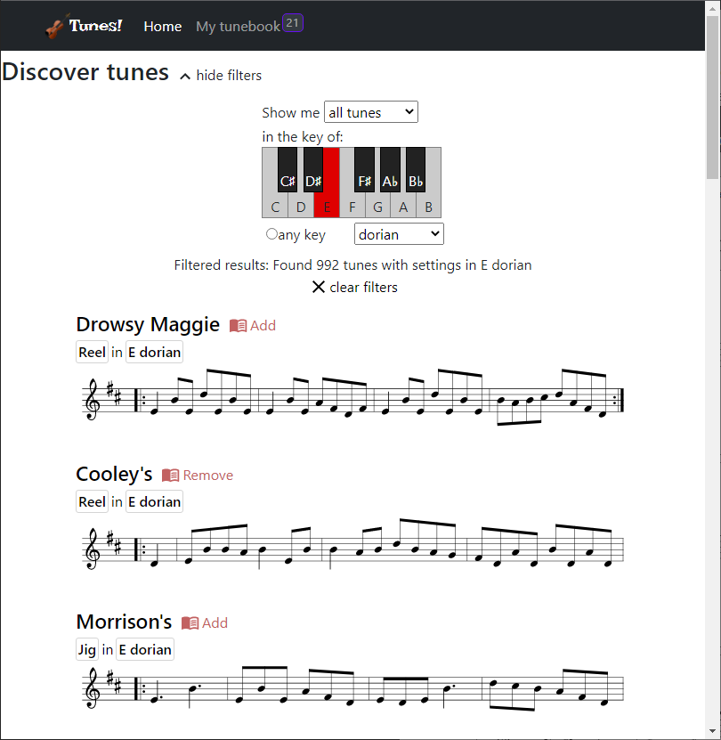

# 🎻Tunes!

### GA React Development course - final project
#### Jon Drews - 2022-08-10

An app for discovering, collecting and learning Irish traditional music. Made by a musician, for musicians :)

### Notes

This app uses data from an API provided by [thesession.org](https://thesession.org/). Tune 'settings' (variants of the same tune) are provided in [ABC notation](https://abcnotation.com/) from thesession.org, and are parsed in my app for display in SVG format using the [abcjs library](https://www.abcjs.net/).

**Many key/mode-based search results may appear erroneous** - for example, searching for tunes in 'C major' may return results for tunes in 'G major' or other seemingly erroneous keys. This is because each search result is a tune that has at least one setting in the requested key/mode - this setting may not necessarily be the primary (first) setting, which is the one displayed on the list of results. Click on the search result, then browse through all the different settings of the tune to find the setting(s) with a key that matches the key you searched for. Future updates will attempt to list only the specific tune settings that match the search key/mode, to avoid this confusion.
